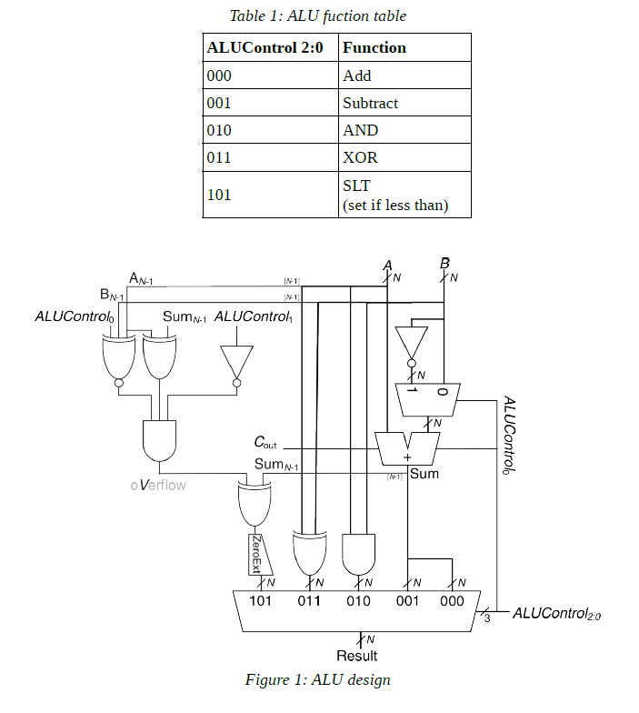

# risc-v-alu-32-bit

### English/

A 32 bit RISC-V ALU design

This ALU can perform add, substract, and, xor and slt functions. There is the instructions right below.

### Turkish/

32 bit RISC-V ALU

Bu ALU ile add, substract, and, xor ve slt fonksiyonları gerçekleştirilebilir. Aşağıda kullanım kılavuzu bulunmaktadır.

